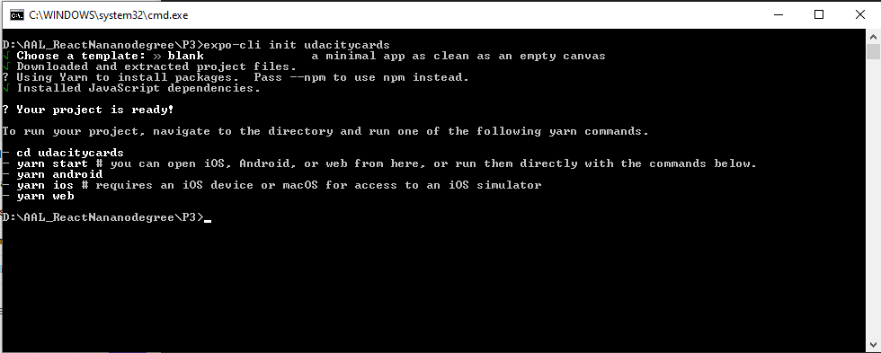

# UdaciCard?

A mobile application (Android or iOS - or both) that allows users to study collections of flashcards. The app will allow users to create different categories of flashcards called "decks", add flashcards to those decks, then take quizzes on those decks.

## Essence of the App:

The App is a 3rd project out of 3 in a path I am following at Udacity titled React Nanodegree. It encompasses the fundamental aspects of building a native application including handling infinite lists, routing, and user input.

## Creating the App

The project uses the Create-React-Native-App in creating the starter template. 
The `create-react-native-app` command can be issued at your favourite command line tool only when Node is installed or you can use yarn.



Clone the app from my GitHub repo using the command 
```git clone https://github.com/bafrimpong/udacicards.git && yarn install```

## Running the App
When all the dependencies are installed, launch the app with

```
expo run:android for Android device
```
OR
```
expo run:ios  for iOS device
```
Also one can opt to use `yarn android` OR `yarn ios` whichever is convenient.
### NOTE
The App have been tested only on Android devices both physical `Infinix X572` and emulator and works well.

## How to Use the App

- Please follow the inserted video to see how the App works

  

# Database

The App uses AsyncStorage to store data.

The `AppDataSource.js` file represents a fake database and methods that let you access data. The data is structured such as below

```
  deck: {
    id,
    title,
    questions : [
      {
        question
        answer
      }
    ]
  }

  'this-is-deck-id': {
    id: this-is-deck-id,
    title: 'Ruby on Rails',
    questions: [
      {
        question: Who invented Ruby?,
        answer: Bismark A. Frimpong
      },
      {
        question: What is the current version of Ruby?,
        answer: 5.0.2
      }
    ]
  }
```
The above shows a typical structure of the database the app is using through the usage of `AsyncStorage`.

## Data

The app code will talk to the database via the following methods:

* `getDecks()`
* `getSaveDeckTitle(title)`
* `addCardToDeck(deckId, card)`
* `deleteCard(cardId)`

1) `getDecks()` Method

*Description*: Gets all of the existing decks from the database.  
*Return Value*: a deck object with id, title, and questions.

2) `getSaveDeckTitle(title)` Method

*Description*: Saves a deck with its title to the database.  
*Return Value*: A deck obejct with it's title

3) `addCardToDeck(deckId, card)` Method

*Description*: Saves a card to a specified deck with the deck id and the card.  
*Parameters*:  A deck object with the card
*Return Value*:  A deck object with its cards

4) `deleteCard(cardId)` Method
*Description*: Deletes or removes a card from a deck.
*Parameters*: A card id
*Return Value*: A deck object with with its cards

## Contributing

This repository is free for *all* especially Udacity students. Therefore, you can clone and use it without any refrence to me.

## Resources and References

I passed through different learning materials from various websites to be able to complete this project which have listed them in a `references.txt` which you can use to learn more.